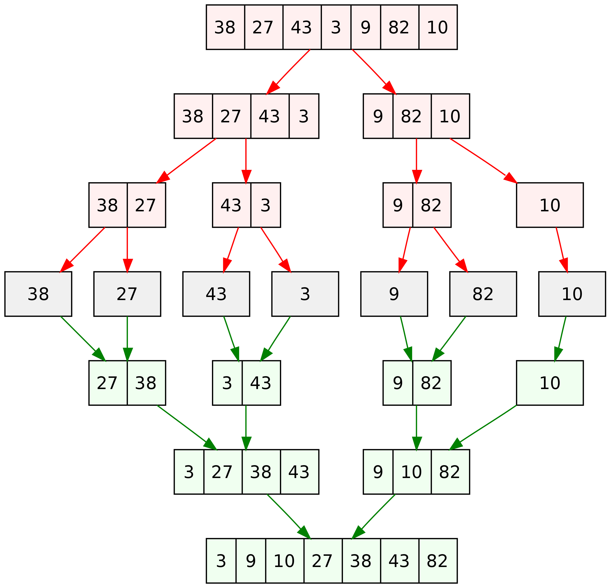
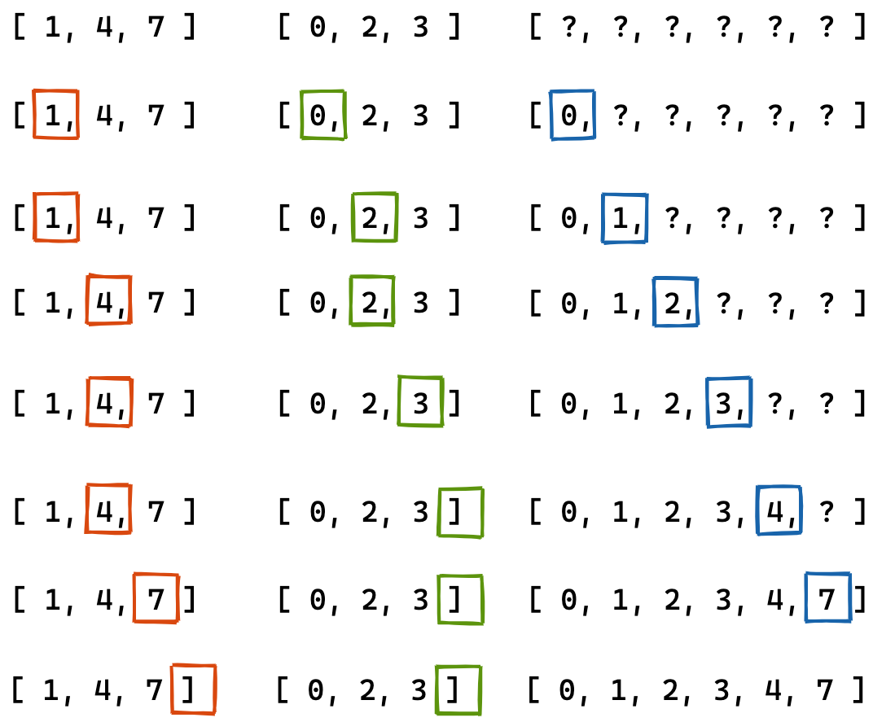
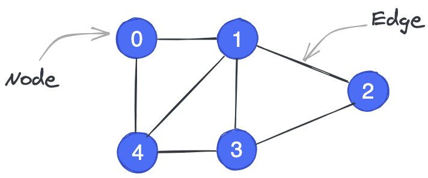
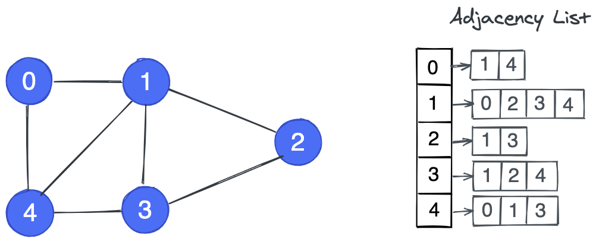
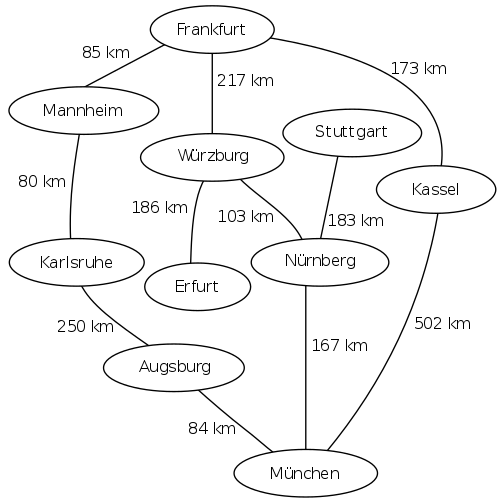
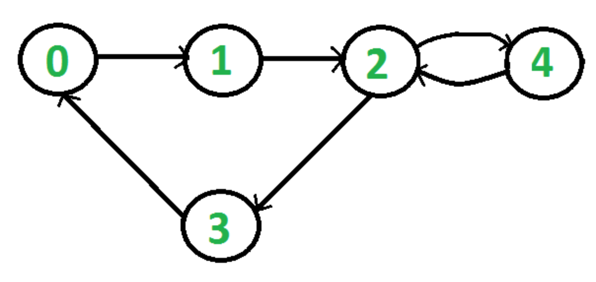
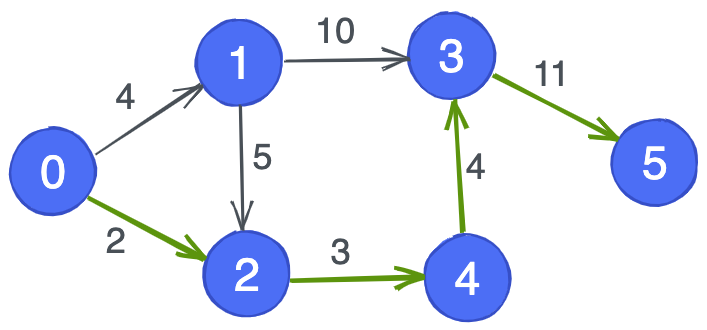
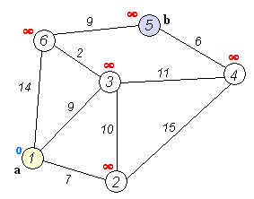

# datastructure
Data Structure and Algorithms Problem statement with examples

Problem statement solved with Linear and Binary search and tests its space and time complexity analysis with python
Note: Run each file separately to see output on terminal

Prerequisites:
    IDE(default Pycharm)
    virtualenv
    install required packages from requirement.txt file using below command
    > pip install -r requirement.txt
    Basic programming known with Python (variables, data types, loops, functions)
    Some mathematics part
    Running on your computer locally, execute single file code.
    
**QUESTION 1: Alice has some cards with numbers written on them. She arranges the cards in decreasing order, and lays them out face down in a sequence on a table. She challenges Bob to pick out the card containing a given number by turning over as few cards as possible. Write a function to help Bob locate the card.**

**Problem Solution:** 
    We need to write a program to find the position of a given number in a list of numbers arranged in decreasing order. We also need to minimize the number of times we access elements from the list.

    Input

        cards: A list of numbers sorted in decreasing order. E.g. [13, 11, 10, 7, 4, 3, 1, 0]
        query: A number, whose position in the array is to be determined. E.g. 7

    Output

        position: The position of query in the list cards. E.g. 3 in the above case (counting from 0)

Here's the test case described in the example above.

    cards = [13, 11, 10, 7, 4, 3, 1, 0]
    query = 7
    output = 3

We'll represent our test cases as dictionaries to make it easier to test them once we write implement our function. For example, the above test case can be represented as follows:

    test = {
    'input': { 
        'cards': [13, 11, 10, 7, 4, 3, 1, 0], 
        'query': 7
    },
    'output': 3
    }

The function can now be tested as follows.

    locate_card(**test['input']) == test['output']

You can find number of test cases declared inside tests.py file and also have large test case to test code complexity

Analyze the algorithm's complexity and identify inefficiencies, if any.
    let's try to count the number of iterations in the algorithm. If we start out with an array of N elements, then each time the size of the array reduces to half for the next iteration, until we are left with just 1 element.

    Initial length - N
    
    Iteration 1 - N/2
    
    Iteration 2 - N/4 i.e. N/2^2
    
    Iteration 3 - N/8 i.e. N/2^3
    
    Iteration k - N/2^k
    
    Since the final length of the array is 1, we can find the
    
    N/2^k = 1
    
    Rearranging the terms, we get
    
    N = 2^k
    
    Taking the logarithm

    k = log N 

Where log refers to log to the base 2. Therefore, our algorithm has the time complexity O(log N). This fact is often stated as: binary search runs in logarithmic time. You can verify that the space complexity of binary search is O(1).

Note: We can test the function by passing the input to it directly or by using the evaluate_test_case function from jovian.
Please do uncomment code where Jovian test cases are imported and implemented in file.  


**Problem Statement : Rotated List**
Question 2: You are given list of numbers, obtained by rotating a sorted list an unknown number of times. Write a function to determine the minimum number of times the original sorted list was rotated to obtain the given list. Your function should have the worst-case complexity of O(log N), where N is the length of the list. You can assume that all the numbers in the list are unique.

    Example: The list [5, 6, 9, 0, 2, 3, 4] was obtained by rotating the sorted list [0, 2, 3, 4, 5, 6, 9] 3 times.

    We define "rotating a list" as removing the last element of the list and adding it before the first element. E.g. rotating the list [3, 2, 4, 1] produces [1, 3, 2, 4].
 
    "Sorted list" refers to a list where the elements are arranged in the increasing order e.g. [1, 3, 5, 7].

Here's the systematic strategy we'll apply for solving problems:

   1. State the problem clearly. Identify the input & output formats.
   2. Come up with some example inputs & outputs. Try to cover all edge cases.
   3. Come up with a correct solution for the problem. State it in plain English.
   4. Implement the solution and test it using example inputs. Fix bugs, if any.
   5. Analyze the algorithm's complexity and identify inefficiencies, if any.
   6. Apply the right technique to overcome the inefficiency. Repeat steps 3 to 6.

We'll express our test cases as dictionaries, to test them easily. Each dictionary will contain 2 keys: input (a dictionary itself containing one key for each argument to the function and output (the expected result from the function). 
Here's an example below.

    test = {
        'input': {
            'nums': [19, 25, 29, 3, 5, 6, 7, 9, 11, 14]
        },
        'output': 3
    }

Example: In the list [19, 25, 29, 3, 5, 6, 7, 9, 11, 14], the number 3 is the only number smaller than its predecessor. 
It occurs at the position 4 (counting from 0), hence the array was rotated 4 times.

If the middle element is smaller than its predecessor, then it is the answer. 
However, if it isn't, this check is not sufficient to determine whether the answer lies to the left or the right of it. 
Consider the following examples.

[7, 8, 1, 3, 4, 5, 6] (answer lies to the left of the middle element)

[1, 2, 3, 4, 5, -1, 0] (answer lies to the right of the middle element)


**Binary Search Trees, Traversals and Balancing**
QUESTION 3: you are tasked with developing a fast in-memory data structure to manage profile information 
(username, name and email) for 100 million users. It should allow the following operations to be performed efficiently:

    1. Insert the profile information for a new user.
    2. Find the profile information of a user, given their username
    3. Update the profile information of a user, given their username
    4. List all the users of the platform, sorted by username
Assuming that usernames are unique.

The various functions can be implemented as follows:

    1. Insert: Loop through the list and add the new user at a position that keeps the list sorted.
    2. Find: Loop through the list and find the user object with the username matching the query.
    3. Update: Loop through the list, find the user object matching the query and update the details
    4. List: Return the list of user objects.

Analyze the algorithm's complexity and identify inefficiencies:
    
The operations insert, find, update involves iterating over a list of users, in the worst case, they may take up to N iterations to return a result, where N is the total number of users. list_all however, simply returns the existing internal list of users.

Thus, the time complexities of the various operations are:

    1. Insert: O(N)
    2. Find: O(N)
    3. Update: O(N)
    4. List: O(1)

Verify that the space complexity of each operation is O(1).

**Balanced Binary Search Trees**

For use case, require the binary tree to have some additional properties:

Keys and Values: Each node of the tree stores a key (a username) and a value (a User object). Only keys are shown in the picture above for brevity. 
A binary tree where nodes have both a key and a value is often referred to as a map or treemap (because it maps keys to values).
Binary Search Tree: The left subtree of any node only contains nodes with keys that are lexicographically smaller than the node's key, 
and the right subtree of any node only contains nodes with keys that lexicographically larger than the node's key. 
A tree that satisfies this property is called a binary search trees, and it's easy to locate a specific key by traversing a single path down from the root note.
Balanced Tree: The tree is balanced i.e. it does not skew too heavily to one side or the other. 
The left and right subtrees of any node shouldn't differ in height/depth by more than 1 level.

Height of a Binary Tree
The number of levels in a tree is called its height. As you can tell from the picture above, each level of a tree contains twice as many nodes as the previous level.

For a tree of height k, here's a list of the number of nodes at each level:

    Level 0: 1
    
    Level 1: 2
    
    Level 2: 4 i.e. 2^2
    
    Level 3: 8 i.e. 2^3
    
    ...
    
    Level k-1: 2^(k-1)

If the total number of nodes in the tree is N, then it follows that

N = 1 + 2^1 + 2^2 + 2^3 + ... + 2^(k-1)

We can simplify this equation by adding 1 on each side:
    
    N + 1 = 1 + 1 + 2^1 + 2^2 + 2^3 + ... + 2^(k-1) 
    
    N + 1 = 2^1 + 2^1 + 2^2+ 2^3 + ... + 2^(k-1) 
    
    N + 1 = = 2^2 + 2^2 + 2^3 + ... + 2^(k-1)
    
    N + 1 = = 2^3 + 2^3 + ... + 2^(k-1)
    
    ...
    
    N + 1 = 2^(k-1) + 2^(k-1)
    
    N + 1 = 2^k
    
    k = log(N + 1) <= log(N) + 1 

Thus, to store N records we require a balanced binary search tree (BST) of height no larger than log(N) + 1. 
This is a very useful property, in combination with the fact that nodes are arranged in a way that makes 
it easy to find a specific key by following a single path down from the root.


**Binary Tree**

**QUESTION 2**: Implement a binary tree using Python, and show its usage with some examples.


**Traversing a Binary Tree**
QUESTION 3: Write a function to perform the inorder traversal of a binary tree.

QUESTION 4: Write a function to perform the preorder traversal of a binary tree.

QUESTION 5: Write a function to perform the postorder traversal of a binary tree.

A traversal refers to the process of visiting each node of a tree exactly once. 
Visiting a node generally refers to adding the node's key to a list. 
There are three ways to traverse a binary tree and return the list of visited keys:

Inorder traversal

    Traverse the left subtree recursively inorder.
    Traverse the current node.
    Traverse the right subtree recursively inorder.

Preorder traversal

    Traverse the current node.
    Traverse the left subtree recursively preorder.
    Traverse the right subtree recursively preorder.

Postorder traversal
    
    Traverse the right subtree recursively postorder.
    Traverse the current node.
    Traverse the left subtree recursively postorder.

**Height and Size of a Binary Tree**

QUESTION 6: Write a function to calculate the height/depth of a binary tree

QUESTION 7: Write a function to count the number of nodes in a binary tree

The height/depth of a binary tree is defined as the length of the longest path from its root node to a leaf. It can be computed recursively.


**Binary Search Tree (BST)**

A binary search tree or BST is a binary tree that satisfies the following conditions:

    1. The left subtree of any node only contains nodes with keys less than the node's key
    2. The right subtree of any node only contains nodes with keys greater than the node's key

QUESTION 8: Write a function to check if a binary tree is a binary search tree (BST).

QUESTION 9: Write a function to find the maximum key in a binary tree.

QUESTION 10: Write a function to find the minimum key in a binary tree.

**Storing Key-Value Pairs using BSTs**

Recall that we need to store user objects with each key in our BST. Let's define new class BSTNode to represent the nodes of our tree. 
Apart from having properties key, left and right, we'll also store a value and pointer to the parent node (for easier upward traversal).

**Insertion into BST**

QUESTION 11: Write a function to insert a new node into a BST.


**Assignment 2 - Hash Tables in Python**

**Python Dictionaries and Hash Tables**

Our objective in this assignment is to implement a HashTable class which supports the following operations:

    1. Insert: Insert a new key-value pair
    2. Find: Find the value associated with a key
    3. Update: Update the value associated with a key
    4. List: List all the keys stored in the hash table

Data List

We'll build the HashTable class step-by-step. As a first step is to create a Python list which will hold all the key-value pairs. 
We'll start by creating a list of a fixed size.


**Assignment 3 - Divide-n-Conquer Algorithms in Python**

## Problem Statement - Polynomial Multiplication

Given two polynomials represented by two lists, write a function that efficiently multiplies given two polynomials. 
For example, the lists `[2, 0, 5, 7]` and `[3, 4, 2]` represent the polynomials $2 + 5x^2 + 7x^3$ and $3 + 4x + 2x^2$.
Their product is $(2 \times 3) + (2 \times 4 + 0 \times 3)x + (2 \times 2 + 3 \times 5 + 4 \times 0)x^2 + 
(7 \times 3 + 5 \times 4 + 0 \times 2)x^3 + (7 \times 4 + 5 \times 2)x^4 + (7 \times 2)x^5$ 
i.e. $6 + 8x + 19x^2 + 41x^3 + 38x^4 + 14x^5$ 
It can be represented by the list `[6, 8, 19, 41, 38, 14]`.


**Merge Sort, Quicksort and Divide-n-Conquer Algorithms in Python**

We need to write a function to sort a list of numbers in increasing order.

Input

    1. nums: A list of numbers e.g. [4, 2, 6, 3, 4, 6, 2, 1]
Output

    2. sorted_nums: The sorted version of nums e.g. [1, 2, 2, 3, 4, 4, 6, 6]

Here are some scenarios we may want to test out:

    1. Some lists of numbers in random order.
    2. A list that's already sorted.
    3. A list that's sorted in descending order.
    4. A list containing repeating elements.
    5. An empty list.
    6. A list containing just one element.
    7. A list containing one element repeated many times.
    8. A really long list.

Analyze the algorithm's complexity and identify inefficiencies:
    The core operations in bubble sort are "compare" and "swap". To analyze the time complexity, 
    we can simply count the total number of comparisons being made, since the total number of swaps 
    will be less than or equal to the total number of comparisons
    ```
    for _ in range(len(nums) - 1):
        for i in range(len(nums) - 1):
            if nums[i] > nums[i+1]:
                nums[i], nums[i+1] = nums[i+1], nums[i]
    ```

There are two loops, each of length `n-1`, where `n` is the number of elements in `nums`. So the total number of comparisons is $(n-1)*(n-1)$ i.e. $(n-1)^2$ i.e. $n^2 - 2n + 1$. 

Expressing this in the Big O notation, we can conclude that the time complexity of bubble sort is $O(n^2)$ (also known as quadratic complexity).

The space complexity of bubble sort is $O(n)$, even thought it requires only constant/zero additional space, 
because the space required to store the inputs is also considered while calculating space complexity.

As we saw from the last test, a list of 10,000 numbers takes about 12 seconds to be sorted using bubble sort. 
A list of ten times the size will 100 times longer i.e. about 20 minutes to be sorted, which is quite inefficient. 
A list of a million elements would take close to 2 days to be sorted.


**Insertion Sort**

Before we look at explore more efficient sorting techniques, here's another simple sorting technique called insertion sort, 
where we keep the initial portion of the array sorted and insert the remaining elements one by one at the right position.

**Merge Sort**

Following a visual representation of the divide and conquer applied for sorting numbers. 
This algorithm is known as merge sort:



QUESTION 3: Write a function to merge two sorted arrays.

Two merge two sorted arrays, we can repeatedly compare the two least elements of each array, and copy over the smaller one into a new array.

Here's a visual representation of the merge operation:



Analyze the algorithm's complexity and identify inefficiencies.
    Analyzing the complexity of recursive algorithms can be tricky. It helps to track and follow the chain of recursive calls. 
    We'll add some print statements to our merge_sort and merge_functions to display the tree of recursive function calls

Space Complexity:
    To find the space complexity of merge sort, it helps to recall that a new list with 
    equal to the sum of the sizes of the two lists is created in each invocation of merge.

At first glance, it may seem that O(n) space is required for each level of the tree, 
so the space complexity of merge sort is O(n log n).

**Quicksort**

To overcome the space inefficiencies of merge sort, we'll study another divide-and-conquer based sorting algorithm called quicksort, which works as follows:

    1. If the list is empty or has just one element, return it. It's already sorted.
    2. Pick a random element from the list. This element is called a pivot. 
    3. Reorder the list so that all elements with values less than or equal to the pivot come before the pivot, 
    while all elements with values greater than the pivot come after it. This operation is called partitioning.
    4. The pivot element divides the array into two parts which can be sorted independently by making a recursive call to quicksort.

cal/Temp/Quicksort.png)

Summary and Exercises
We've covered the following sorting algorithms in this tutorial:

    1. Bubble sort
    2. Insertion sort
    3. Merge sort
    4. Quick sort

**Lesson 4**
**Recursion and Dynamic Programming**

QUESTION 1: Write a function to find the length of the longest common subsequence between two sequences. 

    E.g. Given the strings "serendipitous" and "precipitation", the longest common subsequence is "reipito" and its length is 7.

    A "sequence" is a group of items with a deterministic ordering. Lists, tuples and ranges are some common sequence types in Python.

    A "subsequence" is a sequence obtained by deleting zero or more elements from another sequence. For example, "edpt" is a subsequence of "serendipitous".

Test cases
    
    1. General case (string)
    2. General case (list)
    3. No common subsequence
    4. One is a subsequence of the other
    5. One sequence is empty
    6. Both sequences are empty
    7. Multiple subsequences with same length
        A. “abcdef” and “badcfe”

Recursive Solution:
Create two counters idx1 and idx2 starting at 0. Our recursive function will compute the LCS of seq1[idx1:] and seq2[idx2:]

    1. If seq1[idx1] and seq2[idx2] are equal, then this character belongs to the LCS of seq1[idx1:] and seq2[idx2:] (why?). 
    2. Further the length this is LCS is one more than LCS of seq1[idx1+1:] and seq2[idx2+1:]
    3. If not, then the LCS of seq1[idx1:] and seq2[idx2:] is the longer one among the LCS of seq1[idx1+1:], seq2[idx2:] and the LCS of seq1[idx1:], seq2[idx2+1:]
    4. If either seq1[idx1:] or seq2[idx2:] is empty, then their LCS is empty.

Complexity Analysis
Worst case occurs when each time we have to try 2 subproblems i.e. when the sequences have no common elements.

**Dynamic programming**

    1. Create a table of size (n1+1) * (n2+1) initialized with 0s, where n1 and n2 are the lengths of the sequences. 
    table[i][j] represents the longest common subsequence of seq1[:i] and seq2[:j]. Here's what the table looks like (source: Kevin Mavani, Medium).
    2. If seq1[i] and seq2[j] are equal, then table[i+1][j+1] = 1 + table[i][j]
    3. If seq1[i] and seq2[j] are equal, then table[i+1][j+1] = max(table[i][j+1], table[i+1][j])
    

**0-1 Knapsack Problem**
Problem statement:

You’re in charge of selecting a football (soccer) team from a large pool of players. Each player has a cost, and a rating. 
You have a limited budget. What is the highest total rating of a team that fits within your budget. Assume that there’s no minimum or maximum team size.


**Lesson 5 - Graph Algorithms (BFS, DFS & Shortest Paths)**

**Graph Algorithms (BFS, DFS, Shortest Paths) using Python**

Graph Data Structure


Adjacency Lists


**Graph Traversal**
Breadth-First Search


BFS pseudocode:

     1  procedure BFS(G, root) is
     2      let Q be a queue
     3      label root as discovered
     4      Q.enqueue(root)
     5      while Q is not empty do
     6          v := Q.dequeue()
     7          if v is the goal then
     8              return v
     9          for all edges from v to w in G.adjacentEdges(v) do
    10              if w is not labeled as discovered then
    11                  label w as discovered
    12                  Q.enqueue(w)

DFS pseudocode :

    procedure DFS_iterative(G, v) is
        let S be a stack
        S.push(v)
        while S is not empty do
            v = S.pop()
            if v is not labeled as discovered then
                label v as discovered
                for all edges from v to w in G.adjacentEdges(v) do 
                    S.push(w)

**Directed Graphs**



**Shortest Paths**
Question: Write a function to find the length of the shortest path between two nodes in a weighted directed graph.
    
Dijkstra's algorithm:
    

    1. Mark all nodes unvisited. Create a set of all the unvisited nodes called the unvisited set.
    2. Assign to every node a tentative distance value: set it to zero for our initial node and to infinity for all other nodes. 
    Set the initial node as current.[16]
    3. For the current node, consider all of its unvisited neighbours and calculate their tentative distances through the current node. 
    Compare the newly calculated tentative distance to the current assigned value and assign the smaller one. 
    For example, if the current node A is marked with a distance of 6, and the edge connecting it with a neighbour B has length 2, 
    then the distance to B through A will be 6 + 2 = 8. If B was previously marked with a distance greater than 8 then change it to 8. 
    Otherwise, the current value will be kept.
    4. When we are done considering all of the unvisited neighbours of the current node, mark the current node as visited 
    and remove it from the unvisited set. A visited node will never be checked again.
    5. If the destination node has been marked visited (when planning a route between two specific nodes) or 
    if the smallest tentative distance among the nodes in the unvisited set is infinity (when planning a complete traversal; 
    occurs when there is no connection between the initial node and remaining unvisited nodes), then stop. The algorithm has finished.
    6. Otherwise, select the unvisited node that is marked with the smallest tentative distance, set it as the new "current node", and go back to step 3.

**Binary Heap**

A data structure to maintain the running minimum/maximum of a set of numbers, supporting efficient addition/removal.

Heap operations:

    Insertion - O(log N)
    Min/Max - O(1)
    (depending on type of heap)
    Deletion - O(log N)
    Convert a list to a heap - O(n)

Question: Implement Dijkstra's shortest path algorithm using the heap module from Python. What is the complexity of the algorithm?
